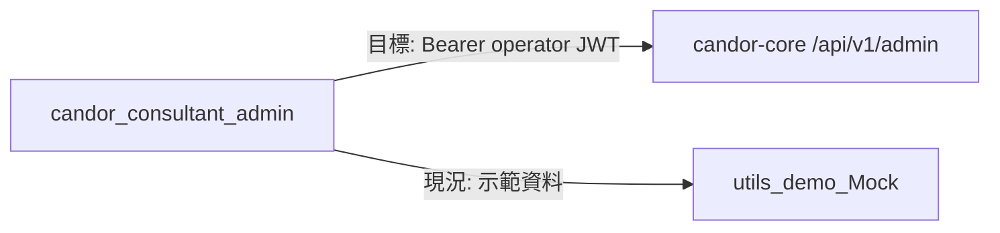

# 01 — 系統架構

## 高層架構

Browser／Nuxt **直連** candor-core admin API（目標）；目前多數畫面讀寫 `stores/ops` + `utils/demo.ts`。拓撲見 [candor-core docs/05](https://github.com/DaydreamLab/candor-core/blob/main/docs/05-integration-architecture.md)。

## 模組邊界

| 模組 | 職責 | 不可做 |
|------|------|--------|
| **pages／components** | 列表、表單、簽核等示範 UI | 為「不做」能力發明後端契約 |
| **stores/session** | 示範登入（cookie）→ 未來 operator JWT | 與客人端共用 token 鍵 |
| **stores/ops** | 示範主檔／案件等狀態 | 把 `case` 語意寫進 OpenAPI |
| **utils/nav** | 側欄分組 | 接線後仍導向必做頁用舊 path 當 API 名 |
| **utils/demo** | 種子假資料 | 當成正式環境資料源 |
| **middleware** | 未登入導向／platform 限定 | 用示範角色冒充 core `expert`／`ops`／`admin` 權限矩陣而不文件化 |

## Mock 邊界

現況：所有業務資料來自 `DEMO_*` 常數與 Pinia；登入為 `loginAs(staffId)`，session 存在 cookie `candor-admin-session`。

目標：新增 admin API client（對齊 younger 的 `useCandorApi` 模式），逐步把 in-scope 頁改為 `已接`；「不做」頁可隱藏、刪除或標示示範-only，但不得打 core。

## 環境（接線後）

| 變數（預期） | 說明 |
|--------------|------|
| `NUXT_PUBLIC_API_BASE` | 建議指向 `…/api/v1`；admin 路徑再加 `/admin`，或另設 admin base——實作時與 CORS 一併文件化 |

CORS 須放行本後台 origin（core `CORS_ALLOWED_ORIGINS`）。

## 與 core 文件分工

| 文件 | 範圍 |
|------|------|
| candor-core spec 29／24 | 端點、權限、身份 |
| candor-core 04／05／31 | 接線狀態、直連、命名 |
| **本檔** | 本 app 模組與 Mock／目標邊界 |

## 相關

- 畫面範圍：[spec/10-screen-scope.md](spec/10-screen-scope.md)
- Session：[spec/11-operator-session.md](spec/11-operator-session.md)
- 進度：[03-progress.md](03-progress.md)
